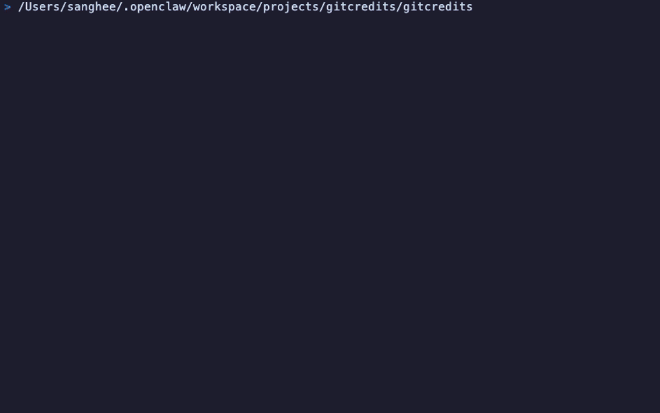

# gitcredits

**Roll movie-style credits for your git repo — right in the terminal.**

<p align="center">
  
</p>

## Install

### Go

```bash
go install github.com/Higangssh/gitcredits@latest
```

### From source

```bash
git clone https://github.com/Higangssh/gitcredits.git
cd gitcredits
go build -o gitcredits .
```

## Usage

```bash
cd your-repo
gitcredits
```

That's it. Navigate into any git repository and run `gitcredits`.

### Themes

**Matrix** — digital rain with text resolve effect:

```bash
gitcredits --theme matrix
```

<p align="center">
  
</p>

### Controls

| Key | Action |
|-----|--------|
| `↑` / `↓` | Manual scroll |
| `q` / `Esc` | Quit |

## What it shows

- **ASCII art title** from your repo name
- **Project lead** — top contributor by commits
- **Contributors** — everyone who committed
- **Notable scenes** — recent `feat:` and `fix:` commits
- **Stats** — total commits, contributors, GitHub stars, language, license

GitHub metadata (stars, description, license) requires [`gh` CLI](https://cli.github.com/) to be installed and authenticated. Works without it — you'll just get git-only data.

## Requirements

- Git
- Go 1.21+
- [`gh` CLI](https://cli.github.com/) (optional, for GitHub metadata)

## License

MIT
